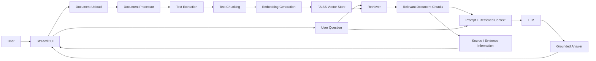

# Smart Document Assistant

A Retrieval-Augmented Generation (RAG) based document question-answering application that allows users to upload PDF and TXT documents and ask natural-language questions about their content.

The application retrieves relevant information from the uploaded documents and uses a Large Language Model (LLM) to generate grounded answers with source information.

---

## 1. Problem Understanding

The goal of this project is to build a Smart Document Assistant that can understand information contained within user-uploaded documents and answer questions based on that information.

Instead of asking an LLM to answer directly from its general knowledge, this application follows a Retrieval-Augmented Generation (RAG) approach:

1. Documents are uploaded by the user.
2. Text is extracted from the documents.
3. The extracted text is divided into smaller searchable chunks.
4. Embeddings are generated for the chunks.
5. The embeddings are stored in a vector database.
6. When the user asks a question, relevant chunks are retrieved.
7. The retrieved context is provided to the LLM.
8. The LLM generates an answer grounded in the retrieved document content.
9. Source/evidence information is displayed along with the response.

The application also handles questions that cannot be answered from the uploaded documents by explicitly informing the user that the required information could not be found rather than attempting to fabricate an answer.

---

## 2. Key Features

### Core Features

- Upload PDF documents
- Upload TXT documents
- Support multiple documents
- Automatic text extraction
- Document chunking
- Semantic embeddings
- FAISS-based vector search
- Retrieval-Augmented Generation (RAG)
- Natural-language question answering
- Source/page information for retrieved content
- Grounded responses based on uploaded documents
- Unknown-question / hallucination handling

### Additional Feature

#### Evidence / Retrieval Strength Indicator

The application provides an evidence/retrieval-strength indicator with answers.

This gives the user an additional signal about how strongly the retrieved document content supports the generated response.

> Note: This indicator represents retrieval/evidence strength and is not a calibrated probability that the answer is correct.

---

## 3. Application Architecture


---

## 4. Technology Stack

| Technology | Purpose |
|---|---|
| Python | Core application development |
| Streamlit | User interface |
| LangChain | RAG pipeline and LLM integration |
| Hugging Face | LLM inference |
| FAISS | Vector similarity search |
| Sentence Transformers | Text embedding generation |
| PyPDF | PDF text extraction |
| NumPy | Numerical processing |
| python-dotenv | Environment variable management |

---

## 5. Technology Choices

### Python
Python was selected because of its strong ecosystem for Generative AI, NLP, embeddings, document processing, and machine learning.

### Streamlit
Streamlit provides a simple and efficient way to build an interactive interface for document upload and question answering without requiring a separate frontend application.

### LangChain
LangChain provides reusable components for document processing, retrieval, prompt construction, and interaction with language models, making it suitable for implementing the RAG pipeline.

### FAISS
FAISS is used as the vector store because it provides efficient similarity search over document embeddings and works well for a lightweight application of this scale.

### Hugging Face
Hugging Face is used for LLM inference. The application communicates with the model through the Hugging Face inference service.

### Sentence Transformers
Sentence embeddings convert document chunks and user questions into numerical vector representations. These vectors allow semantically similar content to be retrieved even when the wording is different.

### PyPDF
PyPDF is used to extract text from uploaded PDF documents.

---

## 6. RAG Pipeline

The application follows the following retrieval and generation process:

### Step 1 — Document Upload
The user uploads one or more PDF or TXT documents through the Streamlit interface.

### Step 2 — Text Extraction
The application extracts textual content from the uploaded documents.

### Step 3 — Chunking
The extracted content is divided into smaller chunks. This allows the retriever to identify specific relevant portions instead of sending an entire document to the LLM.

### Step 4 — Embedding Generation
Each chunk is converted into a numerical embedding representing its semantic meaning.

### Step 5 — Vector Storage
The generated embeddings are stored in a FAISS vector index.

### Step 6 — Retrieval
When the user asks a question, semantically relevant chunks are retrieved from FAISS.

### Step 7 — LLM Generation
The user question and retrieved context are supplied to the LLM. The model generates an answer using the retrieved document information.

### Step 8 — Evidence Display
The application displays source/evidence information along with the generated answer.

---

## 7. Hallucination and Unknown-Question Handling

Reducing hallucination is an important design requirement of this application.

The application uses Retrieval-Augmented Generation so that the LLM receives relevant content from the uploaded documents before generating an answer.

The solution attempts to reduce hallucination through:

- Retrieval of relevant document chunks before generation
- Providing retrieved document context to the LLM
- Prompting the model to answer using the provided context
- Displaying source/evidence information
- Detecting situations where sufficient information is not available
- Returning an explicit response instead of inventing unsupported information

For example, if the uploaded documents contain employee policies but the user asks:

> What is the company's stock price?

and the documents do not contain that information, the application responds that the information could not be found in the uploaded documents rather than generating an unsupported answer.

---

## 8. Project Structure

```text
smart-document-assistant/
│
├── app.py
├── config/
│   └── settings.py
│
├── src/
│   ├── chatbot.py
│   ├── document_processor.py
│   ├── embeddings.py
│   ├── retriever.py
│   ├── utils.py
│   └── vector_store.py
│
├── tests/
├── docs/
├── screenshots/
├── requirement.txt
├── test_chatbot.py
├── upload_docs.py
├── .gitignore
└── readme.md
```

---

## 9. Installation and Setup

### Prerequisites

- Python 3.9 or later
- pip
- Hugging Face API access

### Clone the Repository

```bash
git clone https://github.com/Dhanush7753/smart-document-assistant.git
cd smart-document-assistant
```

### Create a Virtual Environment

```bash
python -m venv venv
```

### Activate the Virtual Environment

Windows PowerShell:

```powershell
.\venv\Scripts\Activate.ps1
```

### Install Dependencies

```bash
pip install -r requirement.txt
```

---

## 10. Environment Variables

Create a `.env` file in the project root directory.

Add the following variable:

```env
HUGGINGFACEHUB_API_TOKEN=your_huggingface_token
```

The token is used to access the Hugging Face inference service.

> Never commit API keys, passwords, tokens, or other secrets to the repository.

The `.env` file is excluded from version control through `.gitignore`.

---

## 11. Running the Application

Start the Streamlit application using:

```bash
streamlit run app.py
```

The application should then be available locally at:

```text
http://localhost:8501
```

### Usage

1. Open the Streamlit application.
2. Upload one or more PDF or TXT documents.
3. Allow the application to process the documents.
4. Enter a question about the uploaded content.
5. Review the generated answer.
6. Review the displayed source/evidence information.
7. Ask additional questions as required.

---

## 12. Testing

The application was tested with both answerable and unanswerable questions.

### Grounded Question Testing

Questions whose answers were present in the uploaded documents were used to verify that relevant chunks were retrieved and supplied to the LLM.

Example:

> What are the main requirements of the application?

The system retrieved the relevant document content and generated a grounded response.

### Unknown-Question Testing

The application was also tested with questions whose answers were not present in the uploaded documents.

Example:

> What is the company's stock price?

The system returned a response indicating that the requested information could not be found in the uploaded documents.

This verifies the unknown-question handling behavior of the application.

### Multi-Document Support

The application supports processing multiple uploaded documents so that information can be retrieved across the available document collection.

---

## 13. Additional Feature — Evidence Indicator

Beyond the core document-question-answering requirements, the application provides an evidence/retrieval-strength indicator.

The purpose of this feature is to give users additional visibility into the retrieval process and the strength of the supporting context.

The indicator should be interpreted as retrieval strength rather than a probability that the generated answer is correct.

---

## 14. AI Tools Used

AI-assisted tools and online technical resources were used during development.

ChatGPT was used for:

- Understanding and decomposing the assignment
- Development assistance
- Debugging dependency and implementation issues
- Reviewing RAG behavior
- Designing test cases
- Improving documentation

Online documentation and publicly available development resources were also consulted during implementation.

All generated or suggested changes were reviewed and tested as part of the development process.

---

## 15. Known Limitations

The current implementation has several limitations:

- Only PDF and TXT document formats are currently supported.
- Retrieval quality depends on the quality and structure of the uploaded documents.
- Complex tables and highly structured PDF layouts may not be extracted perfectly.
- Very large document collections may require additional optimization.
- The evidence indicator represents retrieval strength and is not a calibrated probability of answer correctness.
- LLM inference requires access to the configured Hugging Face service.
- The current FAISS-based storage approach is designed for the scope of this assignment rather than large-scale production deployment.

---

## 16. Future Improvements

Given additional development time, the application could be improved with:

- DOCX, CSV, and Excel support
- Hybrid semantic and keyword retrieval
- Reranking of retrieved chunks
- Improved chunking strategies
- Automatic document summarization
- Document comparison
- Query suggestions
- Persistent document collections
- Conversation memory across sessions
- More comprehensive RAG evaluation
- Production deployment and authentication

---

## 17. Time Spent

Approximate development time:

| Activity | Time |
|---|---:|
| Problem understanding and planning | 30 minutes |
| Development and RAG implementation | 5 hours |
| Testing and debugging | 1.5 hours |
| Documentation and submission preparation | 1 hour |
| **Total** | **8 hours** |

---

## 18. Assignment Requirements Covered

| Requirement | Implementation |
|---|---|
| PDF upload | Supported |
| TXT upload | Supported |
| Multiple documents | Supported |
| Text extraction | Implemented |
| Searchable chunks | Implemented |
| Embeddings | Implemented |
| Searchable store | FAISS |
| Question input | Streamlit |
| Relevant information retrieval | Implemented |
| LLM answer generation | Implemented |
| Grounded answers | RAG-based context |
| Source/evidence information | Implemented |
| Unknown-question handling | Implemented |
| Additional creative feature | Evidence/retrieval-strength indicator |
| Architecture/data flow | Documented above |

---

## 19. Security

Sensitive information is not stored in the repository.

The following are excluded through `.gitignore`:

- `.env`
- Virtual environments
- Python cache files
- Generated vector database files
- IDE-specific files
- Log files

API tokens must be supplied locally through environment variables.

---

## 20. Conclusion

The Smart Document Assistant demonstrates an end-to-end Retrieval-Augmented Generation workflow for document-based question answering.

It combines document processing, text chunking, semantic embeddings, FAISS retrieval, and LLM generation to produce answers grounded in uploaded documents.

The implementation also focuses on hallucination reduction by retrieving evidence before generation and explicitly handling questions for which supporting information is unavailable.

---

## Repository

**GitHub:**  
https://github.com/Dhanush7753/smart-document-assistant